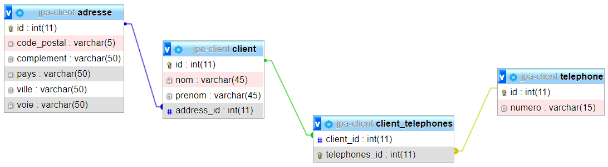

# 8 - @OneToOne & @OneToMany (corrigé) : ASSOCIATION UNIRECTIONNELLE DE 1 VERS n (**client04**)

TRAVAIL A REALISER :

- mettre en place une association unidirectionnelle de un vers plusieurs entre **Client** et **Telephone**.

- créer le projet **client04**
- recopier le contenu du projet client03
- ajouter la classe **Telephone**
- modifier la classe **Client**

La classe entité **Telephone** comportera les attributs suivants :

```java
    private int id;
    private String numero;
    private int type;
```

- La clé primaire **id** sera autogénérée.

La classe **Client** comportera un attribut supplémentaire **telephones** :

>Un Client peut avoir plusieurs Téléphones. L’attribut **telephones** est une Collection d’objets de type **Téléphone**.

Un petit coup de pouce :

```java
    private int id;
    private String nom;
    private String prenom;
    private Adresse adresse;
    private Collection<Telephone> telephones;
```

## Mise en place de l’association unidirectionnelle de 1 vers n

La navigabilité de l’association est de **Client** vers **Telephone**.

L’annotation **@OneToMany** sur la méthode **getTelephones()** de Client indique la navigabilité de Client vers Telephone.

```java
 @OneToMany(cascade={CascadeType.ALL}, fetch=FetchType.EAGER)
 public Collection<Telephone> getTelephones() {
      return telephones;
    }
```

>L’absence d’attribut client dans la classe Telephone indique le caractère unidirectionnel de l’association. Cela signifie que depuis un objet Téléphone, on ne peut pas accèder au Client qui y est associé.

- Créez les repositories nécessaires

Code du Contrôleur :

```java
 @CrossOrigin("*")
@RestController
public class ClientController {

	@Autowired
	private ClientRepository clientRepository;

	@Autowired
	private AdresseRepository adresseRepository;
	
	@Autowired
	private TelephoneRepository telephoneRepository;

	@GetMapping("/accueil")
	@ResponseBody
	public String home()
	{

		  Adresse adresse1=new Adresse("5, rue du Renard","","75015","PARIS", "FRANCE");
          Client client1=new Client("MARTIN","Jean");
          client1=clientRepository.saveAndFlush(client1);
          
          Adresse adresse2=new Adresse("5, rue du Renard","","75015","PARIS","FRANCE");
          Client client2=new Client("DUPONT","sophie",adresse2);
          adresse2.setClient(client2);
          client2=clientRepository.saveAndFlush(client2);
          
          Adresse adresse3=new Adresse("20, boulevard Gambetta","","78300","POISSY","FRANCE");
          Client client3=new Client("DURAND","Pierre",adresse3);
          adresse3.setClient(client3);
          client3=clientRepository.saveAndFlush(client3);
          
          Adresse adresse4=new Adresse("29, boulevard Devaux","","78300","POISSY","FRANCE");
          Client client4=new Client("MADEC","Denis",adresse4);
          adresse4.setClient(client4);
          client4=clientRepository.saveAndFlush(client4);
       
          System.out.println("liste de tous les clients:");
          Collection<Client> liste=clientRepository.findAll();
          affiche(liste);
          
       
          System.out.println("MARTIN Jean habite desormais avec DUPONT Sophie");
          client1.setAdresse(adresse1);
          adresse1.setClient(client1);
          clientRepository.save(client1);

          System.out.println("Liste de toutes les adresses et les clients associés:");
          Collection<Adresse> listeAdresses = adresseRepository.findAll();
          for (Adresse adresse : listeAdresses)
          {
        	  System.out.print(adresse+"  client : ");
        	  if (adresse.getClient()!=null) System.out.println(adresse.getClient());
            	  
          }
          
          Telephone tel1=new Telephone("01 43 65 87 34");
          telephoneRepository.save(tel1);
          System.out.println("le numero "+tel1.getNumero()+" est ajoute au client "+client1);
          
          ajoutTelephone(client1.getId(),tel1);
          
          Telephone tel2=new Telephone("01 65 34 01 23");
          telephoneRepository.save(tel2);
          System.out.println("le numero "+tel2.getNumero()+" est ajoute au client "+client2);
          
          ajoutTelephone(client2.getId(),tel2);
          
          Telephone tel3=new Telephone("02 78 99 41 73");
          telephoneRepository.save(tel3);
          System.out.println("le numero "+tel3.getNumero()+" est ajoute au client "+client3);
          
          ajoutTelephone(client3.getId(),tel3);
          
          Telephone tel4=new Telephone("02 65 98 23 08");
          telephoneRepository.save(tel4);
          System.out.println("le numero "+tel4.getNumero()+" est ajoute au client "+client3);
          
         ajoutTelephone(client3.getId(),tel4);
          
          System.out.println("liste de tous les clients:");
          liste=clientRepository.findAll();
          affiche(liste);
          
          System.out.println("le numero "+tel2.getNumero()+" est supprime du client "+client2);
          
          enleveTelephone(client2.getId(),tel2);

		System.out.println("Liste de tous les clients:");
		
		this.affiche(clientRepository.findAll());

		StringBuilder sb = new StringBuilder();
		sb.append("<h1>Regardez dans votre console et dans votre base de données MySQL <strong>JPA</strong></h1>");
		sb.append("<a href='http://localhost:8080/clients'>Voir la liste des clients enregistrés</a>");
		return  sb.toString();

	}

	@GetMapping(value = "/clients")
	public ResponseEntity<?> getAll(){
		List<Client> liste = null;
		try
		{
			liste = clientRepository.findAll();
		} catch (Exception e) {
			return ResponseEntity.status(HttpStatus.NOT_FOUND).body(null);
		}

		return ResponseEntity.status(HttpStatus.OK).body(liste);
	}

	/**
	 * Méthode pour affichage dans la console
	 * @param liste
	 */
	private void affiche(Collection<Client> liste)
	{

		for (Client client : liste) {

			System.out.println(client);
		}


	}
	
	  private boolean ajoutTelephone(int idClient,Telephone numero){
	    	// on recherche le client
	        Client cl=clientRepository.getOne(idClient);
	        if(cl!=null)
	        {
	        	// on ajoute le téléphone
	            cl.getTelephones().add(numero);
	            clientRepository.saveAndFlush(cl);
	            return true;
	        }
	            return false;
	    }
	    
	    private boolean enleveTelephone(int idClient,Telephone numero){
	    	Client cl=clientRepository.getOne(idClient);
	        if(cl!=null)
	        {
	            for(Telephone num : cl.getTelephones())
	            {
	                if(num.equals(numero))
	                {
	                    cl.getTelephones().remove(num);
	                    telephoneRepository.delete(num);
	                    clientRepository.saveAndFlush(cl);
	                    return true;
	                }
	            }
	        }
	        return false;
	    }
}
```

- Lancez l'application Spring Boot et observez les tables générées dans votre base de données.

- Appelez la méthode **home()** dans votre navigateur pour initialiser les clients en base de données en saisissant l'url ci-dessous dans votre navigateur :
  
[http://localhost:8080/accueil](http://localhost:8080/accueil)

- Ensuite cliquez sur ce lien [http://localhost:8080/clients](http://localhost:8080/clients) pour visualiser vos clients enregistrés.



Voici ce que vous devez obtenir comme base de données sous MySQL :

```sql
CREATE TABLE IF NOT EXISTS `adresse` (
  `id` int(11) NOT NULL,
  `codePostal` varchar(255) DEFAULT NULL,
  `complement` varchar(255) DEFAULT NULL,
  `pays` varchar(255) DEFAULT NULL,
  `ville` varchar(255) DEFAULT NULL,
  `voie` varchar(255) DEFAULT NULL,
  PRIMARY KEY (`id`)
) ENGINE=InnoDB DEFAULT CHARSET=utf8;

CREATE TABLE IF NOT EXISTS `client` (
  `id` int(11) NOT NULL,
  `nom` varchar(255) DEFAULT NULL,
  `prenom` varchar(255) DEFAULT NULL,
  `ADDRESS_ID` int(11) DEFAULT NULL,
  PRIMARY KEY (`id`),
  KEY `ADDRESS_ID` (`ADDRESS_ID`)
) ENGINE=InnoDB DEFAULT CHARSET=utf8;

CREATE TABLE IF NOT EXISTS `client_telephone` (
  `CLIENT_ID` int(11) DEFAULT NULL,
  `TELEPHONES_ID` int(11) DEFAULT NULL,
  KEY `CLIENT_ID` (`CLIENT_ID`),
  KEY `TELEPHONES_ID` (`TELEPHONES_ID`)
) ENGINE=InnoDB DEFAULT CHARSET=utf8;

CREATE TABLE IF NOT EXISTS `telephone` (
  `id` int(11) NOT NULL,
  `numero` varchar(255) DEFAULT NULL,
  `type` int(11) DEFAULT NULL,
  PRIMARY KEY (`id`)
) ENGINE=InnoDB DEFAULT CHARSET=utf8;

--
-- Contraintes pour la table `client`
--
ALTER TABLE `client`
  ADD CONSTRAINT `client_ibfk_1` FOREIGN KEY (`ADDRESS_ID`) REFERENCES `adresse` (`id`);

--
-- Contraintes pour la table `client_telephone`
--
ALTER TABLE `client_telephone`
  ADD CONSTRAINT `client_telephone_ibfk_1` FOREIGN KEY (`CLIENT_ID`) REFERENCES `client` (`id`),
  ADD CONSTRAINT `client_telephone_ibfk_2` FOREIGN KEY (`TELEPHONES_ID`) REFERENCES `telephone` (`id`);

```

[Retour vers les exercices](https://pbouget.github.io/cours/framework-back/1-jpa-orm/mapping-orm.html)

[Retour vers le cours complet](https://pbouget.github.io/cours/)